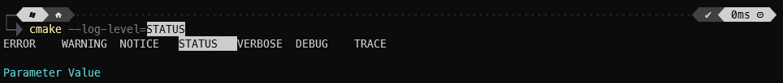
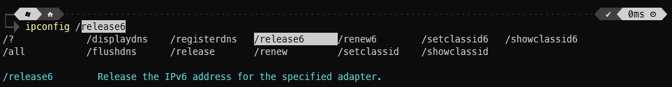
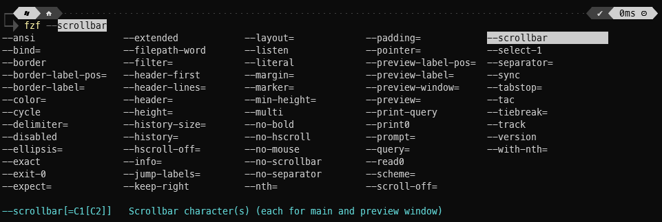
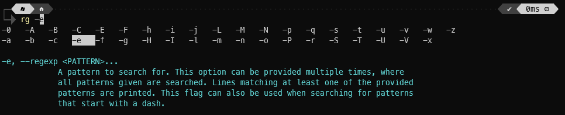

# HelpParser PowerShell Module


[](https://github.com/jjcarrier/HelpParser/actions/workflows/ci.yml)

> **Note**
> This is a work in progress.
  There are known flaws, but it is in a very much usable state.

## Description

Provides a generic solution for parsing a given command's `help` command output.
This is primarily intended as a helper for quickly providing tab-completion
support for arbitrary cmd/bash-centric CLI tools.

## Installation

Install the module from `PSGallery`:

```pwsh
Install-Module -Name HelpParser -Repository PSGallery
```

Load the module via:

```pwsh
Import-Module HelpParser
```

## PSReadLine

Persumably, users of this module are using it to gain easy to implement
tab-completion for their favorite CLI programs in PowerShell.

For full featured (tab)completion it is recommended to enable PSReadLine, this
may already be installed on the system, but it can be installed/updated from
PSGallery.

```pwsh
Install-Module -Name "PSReadLine" -Repository PSGallery
```

The following is a configuration a recommended configuration that can be added
to `$PROFILE`. The last line being the most essential setting.

```pwsh
Set-PSReadLineOption -HistoryNoDuplicates:$true
Set-PSReadLineOption -PredictionSource HistoryAndPlugin
Set-PSReadLineKeyHandler -Function AcceptNextSuggestionWord -Chord Ctrl+Shift+RightArrow
Set-PSReadLineKeyHandler -Key UpArrow -Function HistorySearchBackward
Set-PSReadLineKeyHandler -Key DownArrow -Function HistorySearchForward
Set-PSReadlineKeyHandler -Key Tab -Function MenuComplete
```

## Usage

To create a new tab-completion handler, use the following cmdlet to generate
the required block of code and output it to a file. In this example a program
called "test" will have code generated to support tab-completion and its help
documentation is accessible via the command `test --help`.

```pwsh
New-HelpParserTabCompleter -OutFile TestCompleter.psm1 -CommandName test -HelpCommand "test --help"
```

Once created, import the new module in your `$PROFILE` or manually load it:

```pwsh
Import-Module ./TestCompleter.psm1
```

This generated code serves as a template and is suitable for most CLI programs.
It may be necessary to customize this further (i.e. filter the help-data prior
to passing it into the various routines).

The repository linked below contains many examples utilizing this module (among
other methods of tab completion):

[PS-TabCompletions](https://github.com/jjcarrier/PS-TabCompletions)

> **Note**
> The examples provided in the repo linked above are not necessarily complete
  solutions. For instance the `gcc` handling could be customized further to use
  `gcc -v --help` to obtain even more tab completion results, but this comes at
  the expense of processing time. In a future version of this module, a feature
  may be introduced to cache the processed tab-completion results to a file
  which could be deserialized instead of re-parsing the help data every time.
  This should improve responsiveness in such cases. For such an implementation,
  it would be advisable to at a minimum check the tool's version to determine if
  caches should be invalidated.

### Tab-Completion Examples

An example using parameter value completion:


An example using an program that uses Win32/MS-DOS style arguments:


Other examples of popular tools (one showing available options another showing
available flags):



### Shortcomings

A significant limitation of this module is that it currently does not have a way
to dig deeper into a sub-command's help documentation, this feature may be added
later on, but likely requires significant rework of the underlying parsing logic.

## Testing

Basic tests are available via [Pester](https://pester.dev/). With Pester setup, run:

```pwsh
Invoke-Pester
```
